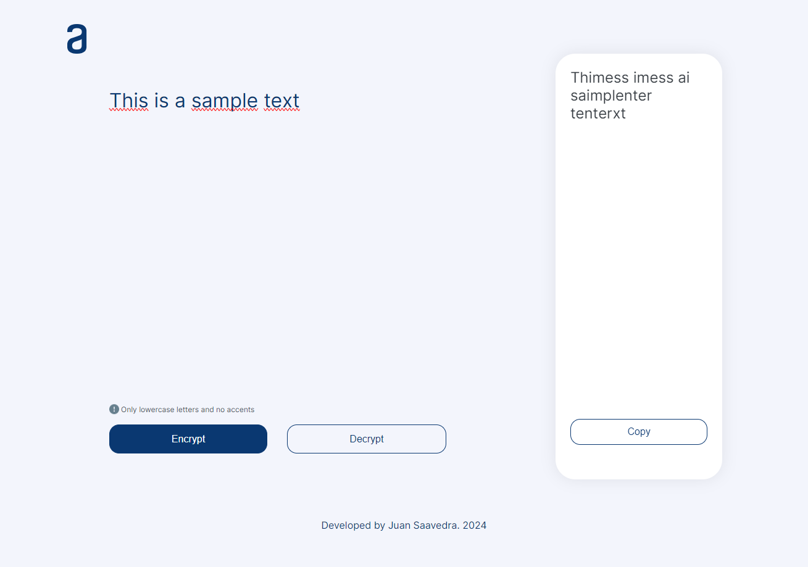
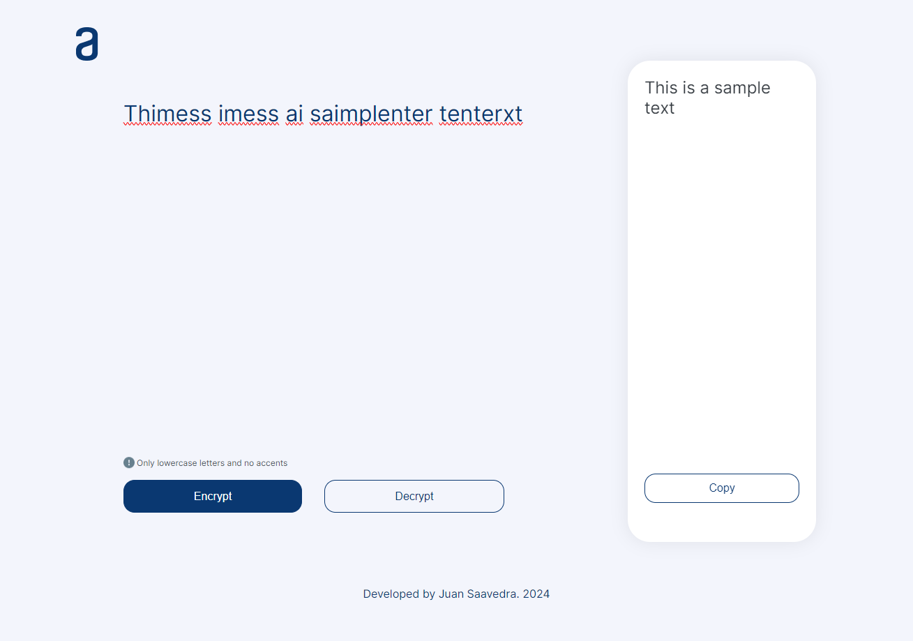

# 🔒 Text Encryptor Web Application

Welcome to the **Text Encryptor Web Application**! This project is a simple yet powerful web app that encrypts text by altering the vowels and decrypts it in the same way. Built with **HTML**, **CSS**, and **JavaScript**, this app showcases basic front-end web development skills with a touch of cryptographic fun!

## 🚀 Features

- **Encryption**: Transform your text by replacing vowels with specific characters.
- **Decryption**: Restore the original text from the encrypted version.
- **User-Friendly Interface**: Clean and intuitive UI for seamless interaction.
- **Lightweight**: No external libraries, purely vanilla HTML, CSS, and JavaScript.

## 🌟 Try it!
Check out the live demo [here](#).

## 📸 Screenshots

*Friendly Interface*


*Encrypt your text with ease.*


*Decrypt your text effortlessly.*


## 🛠️ Installation

To run this project locally, follow these steps:

**Clone the repository**
   ```bash
   git clone https://github.com/yourusername/text-encryptor.git

bash
Copiar código
git clone https://github.com/yourusername/text-encryptor.git
Navigate to the project directory

bash
Copiar código
cd text-encryptor
Open index.html in your preferred browser

bash
Copiar código
open index.html

## 🔍 How It Works

The encryption works by replacing vowels in the text with specific characters:
- `a` ➡️ `@`
- `e` ➡️ `3`
- `i` ➡️ `!`
- `o` ➡️ `0`
- `u` ➡️ `^`

The decryption process reverses these replacements.

## 📂 Project Structure
arduino
Copiar código
text-encryptor/
├── assets/
│   └── Logo.png
│   └── Result_image.png
│   └── Vector.png
├── css/
│   └── style.css
├── js/
│   └── app.js
├── index.html
└── README.md
- **index.html**: The main HTML file.
- **css/style.css**: The CSS file for styling.
- **js/app.js**: The JavaScript file for encryption and decryption logic.
- **assets/**: Folder for images and other assets.

## 🤝 Contributing

Contributions are welcome! If you'd like to contribute, please fork the repository and use a feature branch. Pull requests are warmly welcome.

1. **Fork the repository**
2. **Create a feature branch**
   ```bash
   git checkout -b feature/AmazingFeature
Commit your changes
bash
Copiar código
git commit -m 'Add some AmazingFeature'
Push to the branch
bash
Copiar código
git push origin feature/AmazingFeature
Open a pull request
📄 License
This project is licensed under the MIT License - see the LICENSE file for details.

🧑‍💻 Author
Juan Sebastian Saavedra Alvarez

[GitHub](https://github.com/jsebastiansaavedra)
[LinkedIn](https://www.linkedin.com/in/jsebastiansaavedra/)

LinkedIn
🎉 Acknowledgements
Special thanks to Alura Latam who inspired this project!

